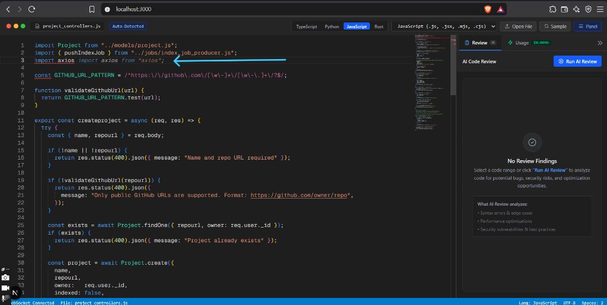
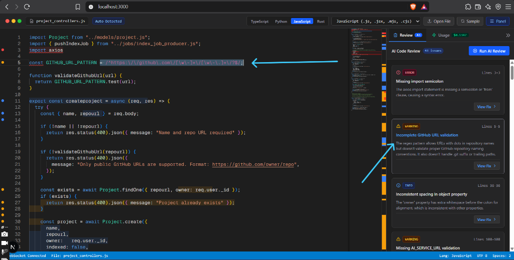
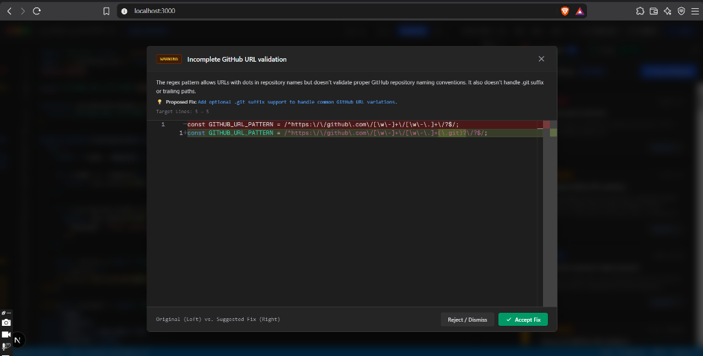
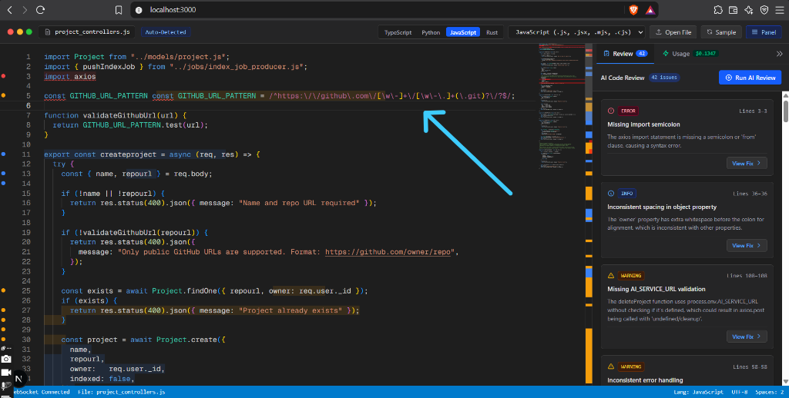

# AI-Powered Code Editor & Real-Time Review Platform

A full-stack AI-native code editor platform built with Next.js 16, Monaco Editor, and WebSockets. The platform provides ultra-fast inline code completions and real-time streaming AI code reviews with side-by-side diffing and atomic fix application.

---

## Features

- **Monaco Editor Experience**: Full-featured code editor with syntax highlighting, gutter glyphs, overview ruler heatmaps, and dark theme.
- **Multi-Language & File Upload**: Out-of-the-box support for TypeScript, JavaScript, Python, Go, Rust, Java, C++, HTML, CSS, JSON, SQL, Markdown, Shell, and more with instant file opening.
- **Fast Inline AI Completions**: Intelligent ghost-text suggestions powered by OpenAI / CometAPI with 250ms debouncing, request cancellation, and single-keystroke tab acceptance.
- **Streaming Code Review Engine**: Real-time code analysis powered by Claude (`claude-opus-5-5` via LLMsRelay or native Anthropic) over persistent WebSockets (`/ws/review`).
- **Incremental JSONL Parser**: Parses streaming AI output line-by-line without buffering delays, accurately mapping snippet lines to root document coordinates.
- **In-Editor Annotations**: Real-time Monaco `deltaDecorations` with severity-coded wavy underlines (error, warning, info), gutter icons, and detailed hover tooltips.
- **Side-by-Side Diff & One-Click Fixes**: Compare proposed changes side-by-side in Monaco Diff Editor and apply fixes atomically via `editor.executeEdits()` with full undo/redo history preservation.
- **Token & Cost Meter**: Live tracking of prompt tokens, completion tokens, and real-time USD session costs for transparency.

---

## Screenshots & Demo

### 1. Fast Inline AI Code Completion
*Intelligent ghost-text suggestions appear as you type with low latency (250ms debounce). Press <kbd>Tab</kbd> to accept.*



---

### 2. Real-Time Streaming AI Code Review
*Full WebSocket streaming analysis highlighting issues directly on the editor surface with wavy underlines, gutter glyphs, severity badges, and overview ruler heatmap.*



---

### 3. Side-by-Side Diff View Modal
*Inspect original code vs. proposed AI fixes side-by-side in Monaco Diff Editor before applying them.*



---

### 4. Atomic Fix Application & Live Token Meter
*One-click fix replaces code cleanly with preserved undo/redo stack (`Ctrl+Z` / `Cmd+Z`) and tracks real-time API token costs.*



---

## Tech Stack

- **Framework**: Next.js 16 (App Router) + React 19
- **Editor**: Monaco Editor (`@monaco-editor/react`)
- **WebSockets**: `ws` integrated into a custom HTTP server (`server.js`)
- **AI Integrations**:
  - Anthropic SDK (`@anthropic-ai/sdk`) via LLMsRelay gateway or direct API
  - OpenAI SDK (`openai`) via CometAPI gateway or direct API
- **Styling**: Tailwind CSS v4

---

## Quick Start

### 1. Prerequisites

- **Node.js**: v18.18+ or v20+ / v22+
- **Package Manager**: npm (or yarn / pnpm)

### 2. Clone and Install Dependencies

```bash
git clone https://github.com/ayushks404/ai-powered-code-editor.git
cd ai-powered-code-editor/ai-code-editor-platform
npm install
```

### 3. Configure Environment Variables

Create a `.env.local` file in the root of `ai-code-editor-platform`:

```bash
touch .env.local
```

Populate `.env.local` with your API keys:

```env
# ==============================================================================
# 1. AI Code Review Configuration (Anthropic Claude via LLMsRelay or Direct)
# ==============================================================================
# For LLMsRelay:
ANTHROPIC_API_KEY=sk-cs4-your-llmsrelay-key
ANTHROPIC_BASE_URL=https://api.llmsrelay.com
ANTHROPIC_MODEL=claude-opus-5-5

# For Direct Anthropic API:
# ANTHROPIC_API_KEY=sk-ant-api03-...
# ANTHROPIC_BASE_URL=https://api.anthropic.com
# ANTHROPIC_MODEL=claude-3-5-sonnet-20241022

# ==============================================================================
# 2. Inline Code Completion Configuration (OpenAI / CometAPI)
# ==============================================================================
# For CometAPI Gateway:
OPENAI_API_KEY=sk-z4ux-your-cometapi-key
OPENAI_BASE_URL=https://api.cometapi.com/v1
OPENAI_MODEL=gpt-4o-mini

# For Direct OpenAI API:
# OPENAI_API_KEY=sk-proj-...
# OPENAI_BASE_URL=https://api.openai.com/v1
# OPENAI_MODEL=gpt-4o-mini
```

> **Note**: Both gateways support OpenAI / Anthropic compatible endpoints. If using direct keys from OpenAI or Anthropic, omit or adjust the `*_BASE_URL` accordingly.

### 4. Run Development Server

The application uses a unified server (`server.js`) handling both Next.js App Router and WebSocket upgrade events on port 3000:

```bash
npm run dev
```

Visit [http://localhost:3000](http://localhost:3000) in your browser.

### 5. Production Build

To verify compilation and run the production server:

```bash
npm run build
npm start
```

---

## Usage Guide

1. **Write or Upload Code**:
   - Write code directly in the Monaco editor or click **"Open File"** in the top bar to load any source file from your computer.
   - Use the language selector to switch between TypeScript, Python, Go, Rust, and others.

2. **Inline Completions**:
   - Type naturally in the editor. After a 250ms pause, AI ghost text appears.
   - Press <kbd>Tab</kbd> to accept the suggestion.

3. **Trigger AI Code Review**:
   - Click the **"Review Code"** button in the header.
   - The review engine streams results incrementally.
   - Findings appear live in the right panel and highlight corresponding lines directly inside the editor.

4. **Review & Apply Fixes**:
   - Click any finding in the panel to jump to the affected line in Monaco.
   - Click **"View Fix"** to inspect side-by-side original vs. suggested code.
   - Click **"Apply Fix"** to replace the code cleanly with undo history intact (<kbd>Ctrl+Z</kbd> / <kbd>Cmd+Z</kbd>).

---

## Project Structure

```text
ai-code-editor-platform/
├── app/
│   ├── api/complete/route.ts   # Route handler for inline AI completions
│   ├── globals.css             # Editor decoration styles, glyphs & animations
│   ├── layout.tsx              # Root HTML layout & fonts
│   └── page.tsx                # Main entry page (Server Component)
├── components/
│   ├── EditorClient.tsx        # Client orchestrator (editor, panel, diff modal state)
│   ├── editor/
│   │   ├── code-editor.tsx     # Monaco editor wrapper with inline completions & decorations
│   │   ├── diff-view-modal.tsx # Side-by-side Monaco diff viewer modal
│   │   └── monaco-utils.ts     # Range translation & Monaco decoration converters
│   └── panel/
│       ├── finding-item.tsx    # Single finding item card with severity badges
│       └── review-panel.tsx    # Collapsible findings sidebar, filter tabs & token meter
├── lib/
│   ├── languages.ts            # Supported language definitions & sample code snippets
│   ├── types.ts                # TypeScript interfaces (Finding, TokenUsage, WebSocket messages)
│   └── use-websocket.ts        # Client WebSocket hook for /ws/review with reconnection
├── ws/
│   └── review-server.ts        # Streaming Anthropic review backend with JSONL parser
├── server.js                   # Unified Next.js + WebSocket HTTP server
└── package.json
```

---

## License

MIT
